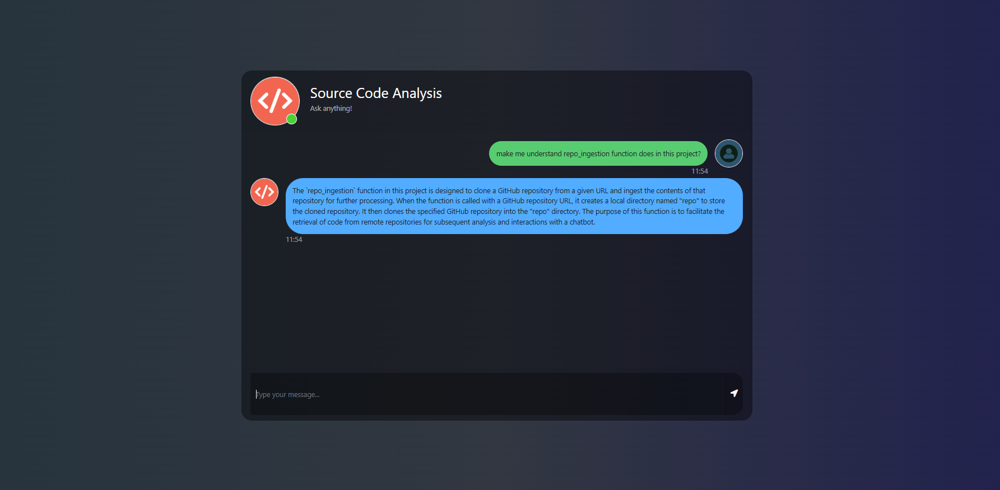

# Source Code Analysis with Generative AI

<p align="center">
  
</p>

## How to Run

### Steps:

1. **Clone the Repository**

    ```bash
    git clone https://github.com/your-repo-url.git
    cd your-repo-directory
    ```

2. **Create a Conda Environment**

    ```bash
    conda create -n llmapp python=3.10 -y
    conda activate llmapp
    ```

3. **Install the Requirements**

    ```bash
    pip install -r requirements.txt
    ```

4. **Set Up Environment Variables**

    Create a `.env` file in the root directory and add your `OPENAI_API_KEY` credentials:

    ```ini
    OPENAI_API_KEY = "xxxxxxxxxxxxxxxxxxxxxxxxxxxxx"
    ```

5. **Run the Application**

    ```bash
    python app.py
    ```

6. **Open the Application**

    Open your browser and navigate to `http://localhost:5000`.

## Tech Stack Used

- **Python**
- **LangChain**
- **Flask**
- **OpenAI**
- **GPT-3**
- **ChromaDB**

## Features

- **Repository Ingestion:** Clone and load GitHub repositories.
- **Text Splitting:** Split documents into manageable chunks.
- **Embeddings:** Generate embeddings using OpenAI.
- **Conversational Retrieval:** Use LangChain for conversational retrieval.

## Contributing

Contributions are welcome! Please open an issue or submit a pull request.

## License

This project is licensed under the MIT License. See the [LICENSE](LICENSE) file for details.

## Acknowledgements

- [LangChain](https://github.com/hwchase17/langchain)
- [OpenAI](https://openai.com/)
- [Flask](https://flask.palletsprojects.com/)
- [ChromaDB](https://www.chromadb.com/)

## Developers

- **Nikhil Bhagat**

<p align="center">
  
  
</p>